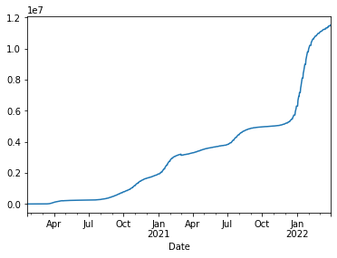

# Uso de API de Covid19 con Pandas

https://api.covid19api.com/

https://api.covid19api.com

## Instalación Pandas

Pandas es una biblioteca de software escrita como extensión de NumPy para manipulación y análisis de datos para el lenguaje de programación Python. Es lo que vamos a instalar para poder extraer los datos.  


```python
!pip install pandas
```

    Requirement already satisfied: pandas in c:\programdata\anaconda3\lib\site-packages (1.2.4)
    Requirement already satisfied: python-dateutil>=2.7.3 in c:\programdata\anaconda3\lib\site-packages (from pandas) (2.8.1)
    Requirement already satisfied: pytz>=2017.3 in c:\programdata\anaconda3\lib\site-packages (from pandas) (2021.1)
    Requirement already satisfied: numpy>=1.16.5 in c:\programdata\anaconda3\lib\site-packages (from pandas) (1.20.1)
    Requirement already satisfied: six>=1.5 in c:\programdata\anaconda3\lib\site-packages (from python-dateutil>=2.7.3->pandas) (1.15.0)
    

## Configuración

A continuación importamos las librerías, un paso muy importante para que podamos extraer los datos. 


```python
import pandas as pd
```

## Variables

La variable en este caso hace referencia a los datos a los que nos referimos, los del covid-19. Pegamos la url para que el programa sepa a lo que nos referimos. 


```python
url = 'https://api.covid19api.com/countries'
```

## Creación de *dataframe*
Utilizamos la función `read_json` para leer los datos en JSON de la API:

Para lo que sirve el dataframe es para guardar datos de distintos tipos en columnas o tablas


```python
df = pd.read_json(url)
```


```python
df
```


<div>
<style scoped>
    .dataframe tbody tr th:only-of-type {
        vertical-align: middle;
    }

    .dataframe tbody tr th {
        vertical-align: top;
    }

    .dataframe thead th {
        text-align: right;
    }
</style>
<table border="1" class="dataframe">
  <thead>
    <tr style="text-align: right;">
      <th></th>
      <th>Country</th>
      <th>Slug</th>
      <th>ISO2</th>
    </tr>
  </thead>
  <tbody>
    <tr>
      <th>0</th>
      <td>Republic of Kosovo</td>
      <td>kosovo</td>
      <td>XK</td>
    </tr>
    <tr>
      <th>1</th>
      <td>Botswana</td>
      <td>botswana</td>
      <td>BW</td>
    </tr>
    <tr>
      <th>2</th>
      <td>Central African Republic</td>
      <td>central-african-republic</td>
      <td>CF</td>
    </tr>
    <tr>
      <th>3</th>
      <td>Hungary</td>
      <td>hungary</td>
      <td>HU</td>
    </tr>
    <tr>
      <th>4</th>
      <td>Peru</td>
      <td>peru</td>
      <td>PE</td>
    </tr>
    <tr>
      <th>...</th>
      <td>...</td>
      <td>...</td>
      <td>...</td>
    </tr>
    <tr>
      <th>243</th>
      <td>Malta</td>
      <td>malta</td>
      <td>MT</td>
    </tr>
    <tr>
      <th>244</th>
      <td>San Marino</td>
      <td>san-marino</td>
      <td>SM</td>
    </tr>
    <tr>
      <th>245</th>
      <td>Gibraltar</td>
      <td>gibraltar</td>
      <td>GI</td>
    </tr>
    <tr>
      <th>246</th>
      <td>Uganda</td>
      <td>uganda</td>
      <td>UG</td>
    </tr>
    <tr>
      <th>247</th>
      <td>Vanuatu</td>
      <td>vanuatu</td>
      <td>VU</td>
    </tr>
  </tbody>
</table>
<p>248 rows × 3 columns</p>
</div>


## Explorar tabla
- Cabecera, con el df.head
- Cola, con el df tail
- Descripción, con el df describe 
recordamos que el df es dataframe, es decir, la forma que tiene phyton de llamar a las tablas. 


```python
df.head()
```


<div>
<style scoped>
    .dataframe tbody tr th:only-of-type {
        vertical-align: middle;
    }

    .dataframe tbody tr th {
        vertical-align: top;
    }

    .dataframe thead th {
        text-align: right;
    }
</style>
<table border="1" class="dataframe">
  <thead>
    <tr style="text-align: right;">
      <th></th>
      <th>Country</th>
      <th>Slug</th>
      <th>ISO2</th>
    </tr>
  </thead>
  <tbody>
    <tr>
      <th>0</th>
      <td>Republic of Kosovo</td>
      <td>kosovo</td>
      <td>XK</td>
    </tr>
    <tr>
      <th>1</th>
      <td>Botswana</td>
      <td>botswana</td>
      <td>BW</td>
    </tr>
    <tr>
      <th>2</th>
      <td>Central African Republic</td>
      <td>central-african-republic</td>
      <td>CF</td>
    </tr>
    <tr>
      <th>3</th>
      <td>Hungary</td>
      <td>hungary</td>
      <td>HU</td>
    </tr>
    <tr>
      <th>4</th>
      <td>Peru</td>
      <td>peru</td>
      <td>PE</td>
    </tr>
  </tbody>
</table>
</div>


```python
df.tail()
```


<div>
<style scoped>
    .dataframe tbody tr th:only-of-type {
        vertical-align: middle;
    }

    .dataframe tbody tr th {
        vertical-align: top;
    }

    .dataframe thead th {
        text-align: right;
    }
</style>
<table border="1" class="dataframe">
  <thead>
    <tr style="text-align: right;">
      <th></th>
      <th>Country</th>
      <th>Slug</th>
      <th>ISO2</th>
    </tr>
  </thead>
  <tbody>
    <tr>
      <th>243</th>
      <td>Malta</td>
      <td>malta</td>
      <td>MT</td>
    </tr>
    <tr>
      <th>244</th>
      <td>San Marino</td>
      <td>san-marino</td>
      <td>SM</td>
    </tr>
    <tr>
      <th>245</th>
      <td>Gibraltar</td>
      <td>gibraltar</td>
      <td>GI</td>
    </tr>
    <tr>
      <th>246</th>
      <td>Uganda</td>
      <td>uganda</td>
      <td>UG</td>
    </tr>
    <tr>
      <th>247</th>
      <td>Vanuatu</td>
      <td>vanuatu</td>
      <td>VU</td>
    </tr>
  </tbody>
</table>
</div>


```python
df.describe()
```


<div>
<style scoped>
    .dataframe tbody tr th:only-of-type {
        vertical-align: middle;
    }

    .dataframe tbody tr th {
        vertical-align: top;
    }

    .dataframe thead th {
        text-align: right;
    }
</style>
<table border="1" class="dataframe">
  <thead>
    <tr style="text-align: right;">
      <th></th>
      <th>Country</th>
      <th>Slug</th>
      <th>ISO2</th>
    </tr>
  </thead>
  <tbody>
    <tr>
      <th>count</th>
      <td>248</td>
      <td>248</td>
      <td>248</td>
    </tr>
    <tr>
      <th>unique</th>
      <td>248</td>
      <td>248</td>
      <td>248</td>
    </tr>
    <tr>
      <th>top</th>
      <td>Kuwait</td>
      <td>puerto-rico</td>
      <td>TG</td>
    </tr>
    <tr>
      <th>freq</th>
      <td>1</td>
      <td>1</td>
      <td>1</td>
    </tr>
  </tbody>
</table>
</div>


```python
df.info()
```

    <class 'pandas.core.frame.DataFrame'>
    RangeIndex: 248 entries, 0 to 247
    Data columns (total 3 columns):
     #   Column   Non-Null Count  Dtype 
    ---  ------   --------------  ----- 
     0   Country  248 non-null    object
     1   Slug     248 non-null    object
     2   ISO2     248 non-null    object
    dtypes: object(3)
    memory usage: 5.9+ KB
    

el df.info suele usarse para saber que no hay celdas vacías y que, por lo tanto, los datos están bien

## Acceso a datos

Vamos a investigar los datos de nuestra tabla. Lo primer es investigar que países la componen para ello uso df ['country']


```python
df['Country']
```


    0            Republic of Kosovo
    1                      Botswana
    2      Central African Republic
    3                       Hungary
    4                          Peru
                     ...           
    243                       Malta
    244                  San Marino
    245                   Gibraltar
    246                      Uganda
    247                     Vanuatu
    Name: Country, Length: 248, dtype: object


Si quisiesemos saber, por ejemplo, qué país ocupa el puesto 200 añadimos [200]


```python
df['Country'][200]
```


    'Angola'


# Tiempo real España

Ahora vamos a estudiar España. Para ello lo primero ponemos la URL de donde queremos extraer los datos. Utilizamos la función `read_json` de *Pandas* para leer los datos en *JSON* de la API. Además, como queremos que sea en tiempo real usamos url_live.


```python
url_es = 'https://api.covid19api.com/country/spain/status/confirmed/live'
df_es = pd.read_json(url_es)
df_es
```


<div>
<style scoped>
    .dataframe tbody tr th:only-of-type {
        vertical-align: middle;
    }

    .dataframe tbody tr th {
        vertical-align: top;
    }

    .dataframe thead th {
        text-align: right;
    }
</style>
<table border="1" class="dataframe">
  <thead>
    <tr style="text-align: right;">
      <th></th>
      <th>Country</th>
      <th>CountryCode</th>
      <th>Province</th>
      <th>City</th>
      <th>CityCode</th>
      <th>Lat</th>
      <th>Lon</th>
      <th>Cases</th>
      <th>Status</th>
      <th>Date</th>
    </tr>
  </thead>
  <tbody>
    <tr>
      <th>0</th>
      <td>Spain</td>
      <td>ES</td>
      <td></td>
      <td></td>
      <td></td>
      <td>40.46</td>
      <td>-3.75</td>
      <td>0</td>
      <td>confirmed</td>
      <td>2020-01-22 00:00:00+00:00</td>
    </tr>
    <tr>
      <th>1</th>
      <td>Spain</td>
      <td>ES</td>
      <td></td>
      <td></td>
      <td></td>
      <td>40.46</td>
      <td>-3.75</td>
      <td>0</td>
      <td>confirmed</td>
      <td>2020-01-23 00:00:00+00:00</td>
    </tr>
    <tr>
      <th>2</th>
      <td>Spain</td>
      <td>ES</td>
      <td></td>
      <td></td>
      <td></td>
      <td>40.46</td>
      <td>-3.75</td>
      <td>0</td>
      <td>confirmed</td>
      <td>2020-01-24 00:00:00+00:00</td>
    </tr>
    <tr>
      <th>3</th>
      <td>Spain</td>
      <td>ES</td>
      <td></td>
      <td></td>
      <td></td>
      <td>40.46</td>
      <td>-3.75</td>
      <td>0</td>
      <td>confirmed</td>
      <td>2020-01-25 00:00:00+00:00</td>
    </tr>
    <tr>
      <th>4</th>
      <td>Spain</td>
      <td>ES</td>
      <td></td>
      <td></td>
      <td></td>
      <td>40.46</td>
      <td>-3.75</td>
      <td>0</td>
      <td>confirmed</td>
      <td>2020-01-26 00:00:00+00:00</td>
    </tr>
    <tr>
      <th>...</th>
      <td>...</td>
      <td>...</td>
      <td>...</td>
      <td>...</td>
      <td>...</td>
      <td>...</td>
      <td>...</td>
      <td>...</td>
      <td>...</td>
      <td>...</td>
    </tr>
    <tr>
      <th>794</th>
      <td>Spain</td>
      <td>ES</td>
      <td></td>
      <td></td>
      <td></td>
      <td>40.46</td>
      <td>-3.75</td>
      <td>11451676</td>
      <td>confirmed</td>
      <td>2022-03-26 00:00:00+00:00</td>
    </tr>
    <tr>
      <th>795</th>
      <td>Spain</td>
      <td>ES</td>
      <td></td>
      <td></td>
      <td></td>
      <td>40.46</td>
      <td>-3.75</td>
      <td>11451676</td>
      <td>confirmed</td>
      <td>2022-03-27 00:00:00+00:00</td>
    </tr>
    <tr>
      <th>796</th>
      <td>Spain</td>
      <td>ES</td>
      <td></td>
      <td></td>
      <td></td>
      <td>40.46</td>
      <td>-3.75</td>
      <td>11451676</td>
      <td>confirmed</td>
      <td>2022-03-28 00:00:00+00:00</td>
    </tr>
    <tr>
      <th>797</th>
      <td>Spain</td>
      <td>ES</td>
      <td></td>
      <td></td>
      <td></td>
      <td>40.46</td>
      <td>-3.75</td>
      <td>11508309</td>
      <td>confirmed</td>
      <td>2022-03-29 00:00:00+00:00</td>
    </tr>
    <tr>
      <th>798</th>
      <td>Spain</td>
      <td>ES</td>
      <td></td>
      <td></td>
      <td></td>
      <td>40.46</td>
      <td>-3.75</td>
      <td>11508309</td>
      <td>confirmed</td>
      <td>2022-03-30 00:00:00+00:00</td>
    </tr>
  </tbody>
</table>
<p>799 rows × 10 columns</p>
</div>


Ahora vamos a obtener la información de toda la tabla con df_es.info


```python
df_es.info()
```

    <class 'pandas.core.frame.DataFrame'>
    RangeIndex: 799 entries, 0 to 798
    Data columns (total 10 columns):
     #   Column       Non-Null Count  Dtype              
    ---  ------       --------------  -----              
     0   Country      799 non-null    object             
     1   CountryCode  799 non-null    object             
     2   Province     799 non-null    object             
     3   City         799 non-null    object             
     4   CityCode     799 non-null    object             
     5   Lat          799 non-null    float64            
     6   Lon          799 non-null    float64            
     7   Cases        799 non-null    int64              
     8   Status       799 non-null    object             
     9   Date         799 non-null    datetime64[ns, UTC]
    dtypes: datetime64[ns, UTC](1), float64(2), int64(1), object(6)
    memory usage: 62.5+ KB
    


```python
df_es.set_index('Date')
```


<div>
<style scoped>
    .dataframe tbody tr th:only-of-type {
        vertical-align: middle;
    }

    .dataframe tbody tr th {
        vertical-align: top;
    }

    .dataframe thead th {
        text-align: right;
    }
</style>
<table border="1" class="dataframe">
  <thead>
    <tr style="text-align: right;">
      <th></th>
      <th>Country</th>
      <th>CountryCode</th>
      <th>Province</th>
      <th>City</th>
      <th>CityCode</th>
      <th>Lat</th>
      <th>Lon</th>
      <th>Cases</th>
      <th>Status</th>
    </tr>
    <tr>
      <th>Date</th>
      <th></th>
      <th></th>
      <th></th>
      <th></th>
      <th></th>
      <th></th>
      <th></th>
      <th></th>
      <th></th>
    </tr>
  </thead>
  <tbody>
    <tr>
      <th>2020-01-22 00:00:00+00:00</th>
      <td>Spain</td>
      <td>ES</td>
      <td></td>
      <td></td>
      <td></td>
      <td>40.46</td>
      <td>-3.75</td>
      <td>0</td>
      <td>confirmed</td>
    </tr>
    <tr>
      <th>2020-01-23 00:00:00+00:00</th>
      <td>Spain</td>
      <td>ES</td>
      <td></td>
      <td></td>
      <td></td>
      <td>40.46</td>
      <td>-3.75</td>
      <td>0</td>
      <td>confirmed</td>
    </tr>
    <tr>
      <th>2020-01-24 00:00:00+00:00</th>
      <td>Spain</td>
      <td>ES</td>
      <td></td>
      <td></td>
      <td></td>
      <td>40.46</td>
      <td>-3.75</td>
      <td>0</td>
      <td>confirmed</td>
    </tr>
    <tr>
      <th>2020-01-25 00:00:00+00:00</th>
      <td>Spain</td>
      <td>ES</td>
      <td></td>
      <td></td>
      <td></td>
      <td>40.46</td>
      <td>-3.75</td>
      <td>0</td>
      <td>confirmed</td>
    </tr>
    <tr>
      <th>2020-01-26 00:00:00+00:00</th>
      <td>Spain</td>
      <td>ES</td>
      <td></td>
      <td></td>
      <td></td>
      <td>40.46</td>
      <td>-3.75</td>
      <td>0</td>
      <td>confirmed</td>
    </tr>
    <tr>
      <th>...</th>
      <td>...</td>
      <td>...</td>
      <td>...</td>
      <td>...</td>
      <td>...</td>
      <td>...</td>
      <td>...</td>
      <td>...</td>
      <td>...</td>
    </tr>
    <tr>
      <th>2022-03-26 00:00:00+00:00</th>
      <td>Spain</td>
      <td>ES</td>
      <td></td>
      <td></td>
      <td></td>
      <td>40.46</td>
      <td>-3.75</td>
      <td>11451676</td>
      <td>confirmed</td>
    </tr>
    <tr>
      <th>2022-03-27 00:00:00+00:00</th>
      <td>Spain</td>
      <td>ES</td>
      <td></td>
      <td></td>
      <td></td>
      <td>40.46</td>
      <td>-3.75</td>
      <td>11451676</td>
      <td>confirmed</td>
    </tr>
    <tr>
      <th>2022-03-28 00:00:00+00:00</th>
      <td>Spain</td>
      <td>ES</td>
      <td></td>
      <td></td>
      <td></td>
      <td>40.46</td>
      <td>-3.75</td>
      <td>11451676</td>
      <td>confirmed</td>
    </tr>
    <tr>
      <th>2022-03-29 00:00:00+00:00</th>
      <td>Spain</td>
      <td>ES</td>
      <td></td>
      <td></td>
      <td></td>
      <td>40.46</td>
      <td>-3.75</td>
      <td>11508309</td>
      <td>confirmed</td>
    </tr>
    <tr>
      <th>2022-03-30 00:00:00+00:00</th>
      <td>Spain</td>
      <td>ES</td>
      <td></td>
      <td></td>
      <td></td>
      <td>40.46</td>
      <td>-3.75</td>
      <td>11508309</td>
      <td>confirmed</td>
    </tr>
  </tbody>
</table>
<p>799 rows × 9 columns</p>
</div>


A continuación vamos a usar set_index. ¿Para qué sirve? Para hacer un gráfico de líneas. Convierte la columna de datos de fecha en la columna del índice.


```python
df_es.set_index('Date')['Cases']
```


    Date
    2020-01-22 00:00:00+00:00           0
    2020-01-23 00:00:00+00:00           0
    2020-01-24 00:00:00+00:00           0
    2020-01-25 00:00:00+00:00           0
    2020-01-26 00:00:00+00:00           0
                                   ...   
    2022-03-26 00:00:00+00:00    11451676
    2022-03-27 00:00:00+00:00    11451676
    2022-03-28 00:00:00+00:00    11451676
    2022-03-29 00:00:00+00:00    11508309
    2022-03-30 00:00:00+00:00    11508309
    Name: Cases, Length: 799, dtype: int64


Queremos que el gráfico empiece por las fechas y con los casos a continuación.Para conseguirlo lo ponemos entre []


```python
df_es.set_index('Date')['Cases'].plot()
```

    Matplotlib is building the font cache; this may take a moment.
    


    <AxesSubplot:xlabel='Date'>


    

    


Vamos a añadir un título. Muy fácil title y entre comillas el título de la tabla


```python
df_es.set_index('Date')['Cases'].plot(title="Casos de Covid-19 en España")
```


    <AxesSubplot:title={'center':'Casos de Covid-19 en España'}, xlabel='Date'>


    

    


## Tiempo real Colombia

VAMOS A HACER LO MISMO, PERO AHORA CON COLOMBIA PARA REPARTIR EL PROCESO Y QUE SE NOS QUEDE BIEN.


```python
url_co = 'https://api.covid19api.com/country/colombia/status/confirmed/live'
df_co = pd.read_json(url_co)
df_co.set_index('Date')['Cases'].plot(title='Datos de Covid-19 en Colombia')
```


    <AxesSubplot:title={'center':'Datos de Covid-19 en Colombia'}, xlabel='Date'>


    

    


## Comparativa España-Colombia

Comparar dos países no es difícil. Tenemos que utilizar las mismas fórmulas que antes, pero esta vez juntas. Lo más importante es usar la función concatenar. Nos une los datos y los compara. 


```python
casos_es = df_es.set_index('Date')['Cases']
casos_co = df_co.set_index('Date')['Cases']
```


```python
casos_co
```


    Date
    2020-01-22 00:00:00+00:00          0
    2020-01-23 00:00:00+00:00          0
    2020-01-24 00:00:00+00:00          0
    2020-01-25 00:00:00+00:00          0
    2020-01-26 00:00:00+00:00          0
                                  ...   
    2022-03-26 00:00:00+00:00    6083291
    2022-03-27 00:00:00+00:00    6083643
    2022-03-28 00:00:00+00:00    6083939
    2022-03-29 00:00:00+00:00    6084240
    2022-03-30 00:00:00+00:00    6084551
    Name: Cases, Length: 799, dtype: int64


```python
casos_es
```


    Date
    2020-01-22 00:00:00+00:00           0
    2020-01-23 00:00:00+00:00           0
    2020-01-24 00:00:00+00:00           0
    2020-01-25 00:00:00+00:00           0
    2020-01-26 00:00:00+00:00           0
                                   ...   
    2022-03-26 00:00:00+00:00    11451676
    2022-03-27 00:00:00+00:00    11451676
    2022-03-28 00:00:00+00:00    11451676
    2022-03-29 00:00:00+00:00    11508309
    2022-03-30 00:00:00+00:00    11508309
    Name: Cases, Length: 799, dtype: int64


```python
Axis 1, para que nos lo ponga a la derecha
```


```python
pd.concat([casos_es,casos_co],axis=1)
```


<div>
<style scoped>
    .dataframe tbody tr th:only-of-type {
        vertical-align: middle;
    }

    .dataframe tbody tr th {
        vertical-align: top;
    }

    .dataframe thead th {
        text-align: right;
    }
</style>
<table border="1" class="dataframe">
  <thead>
    <tr style="text-align: right;">
      <th></th>
      <th>Cases</th>
      <th>Cases</th>
    </tr>
    <tr>
      <th>Date</th>
      <th></th>
      <th></th>
    </tr>
  </thead>
  <tbody>
    <tr>
      <th>2020-01-22 00:00:00+00:00</th>
      <td>0</td>
      <td>0</td>
    </tr>
    <tr>
      <th>2020-01-23 00:00:00+00:00</th>
      <td>0</td>
      <td>0</td>
    </tr>
    <tr>
      <th>2020-01-24 00:00:00+00:00</th>
      <td>0</td>
      <td>0</td>
    </tr>
    <tr>
      <th>2020-01-25 00:00:00+00:00</th>
      <td>0</td>
      <td>0</td>
    </tr>
    <tr>
      <th>2020-01-26 00:00:00+00:00</th>
      <td>0</td>
      <td>0</td>
    </tr>
    <tr>
      <th>...</th>
      <td>...</td>
      <td>...</td>
    </tr>
    <tr>
      <th>2022-03-26 00:00:00+00:00</th>
      <td>11451676</td>
      <td>6083291</td>
    </tr>
    <tr>
      <th>2022-03-27 00:00:00+00:00</th>
      <td>11451676</td>
      <td>6083643</td>
    </tr>
    <tr>
      <th>2022-03-28 00:00:00+00:00</th>
      <td>11451676</td>
      <td>6083939</td>
    </tr>
    <tr>
      <th>2022-03-29 00:00:00+00:00</th>
      <td>11508309</td>
      <td>6084240</td>
    </tr>
    <tr>
      <th>2022-03-30 00:00:00+00:00</th>
      <td>11508309</td>
      <td>6084551</td>
    </tr>
  </tbody>
</table>
<p>799 rows × 2 columns</p>
</div>


```python
vs = pd.concat([casos_es,casos_co],axis=1)
```


<div>
<style scoped>
    .dataframe tbody tr th:only-of-type {
        vertical-align: middle;
    }

    .dataframe tbody tr th {
        vertical-align: top;
    }

    .dataframe thead th {
        text-align: right;
    }
</style>
<table border="1" class="dataframe">
  <thead>
    <tr style="text-align: right;">
      <th></th>
      <th>Cases</th>
      <th>Cases</th>
    </tr>
    <tr>
      <th>Date</th>
      <th></th>
      <th></th>
    </tr>
  </thead>
  <tbody>
    <tr>
      <th>2020-01-22 00:00:00+00:00</th>
      <td>0</td>
      <td>0</td>
    </tr>
    <tr>
      <th>2020-01-23 00:00:00+00:00</th>
      <td>0</td>
      <td>0</td>
    </tr>
    <tr>
      <th>2020-01-24 00:00:00+00:00</th>
      <td>0</td>
      <td>0</td>
    </tr>
    <tr>
      <th>2020-01-25 00:00:00+00:00</th>
      <td>0</td>
      <td>0</td>
    </tr>
    <tr>
      <th>2020-01-26 00:00:00+00:00</th>
      <td>0</td>
      <td>0</td>
    </tr>
    <tr>
      <th>...</th>
      <td>...</td>
      <td>...</td>
    </tr>
    <tr>
      <th>2022-03-26 00:00:00+00:00</th>
      <td>11451676</td>
      <td>6083291</td>
    </tr>
    <tr>
      <th>2022-03-27 00:00:00+00:00</th>
      <td>11451676</td>
      <td>6083643</td>
    </tr>
    <tr>
      <th>2022-03-28 00:00:00+00:00</th>
      <td>11451676</td>
      <td>6083939</td>
    </tr>
    <tr>
      <th>2022-03-29 00:00:00+00:00</th>
      <td>11508309</td>
      <td>6084240</td>
    </tr>
    <tr>
      <th>2022-03-30 00:00:00+00:00</th>
      <td>11508309</td>
      <td>6084551</td>
    </tr>
  </tbody>
</table>
<p>799 rows × 2 columns</p>
</div>


```python
Vamos a dar nombre a las columnas. En el objeto vs.columns ponemos entre corchetes como queremos que se llamen.
```


```python
vs.columns = ['España','Colombia']
```


<div>
<style scoped>
    .dataframe tbody tr th:only-of-type {
        vertical-align: middle;
    }

    .dataframe tbody tr th {
        vertical-align: top;
    }

    .dataframe thead th {
        text-align: right;
    }
</style>
<table border="1" class="dataframe">
  <thead>
    <tr style="text-align: right;">
      <th></th>
      <th>España</th>
      <th>Colombia</th>
    </tr>
    <tr>
      <th>Date</th>
      <th></th>
      <th></th>
    </tr>
  </thead>
  <tbody>
    <tr>
      <th>2020-01-22 00:00:00+00:00</th>
      <td>0</td>
      <td>0</td>
    </tr>
    <tr>
      <th>2020-01-23 00:00:00+00:00</th>
      <td>0</td>
      <td>0</td>
    </tr>
    <tr>
      <th>2020-01-24 00:00:00+00:00</th>
      <td>0</td>
      <td>0</td>
    </tr>
    <tr>
      <th>2020-01-25 00:00:00+00:00</th>
      <td>0</td>
      <td>0</td>
    </tr>
    <tr>
      <th>2020-01-26 00:00:00+00:00</th>
      <td>0</td>
      <td>0</td>
    </tr>
    <tr>
      <th>...</th>
      <td>...</td>
      <td>...</td>
    </tr>
    <tr>
      <th>2022-03-26 00:00:00+00:00</th>
      <td>11451676</td>
      <td>6083291</td>
    </tr>
    <tr>
      <th>2022-03-27 00:00:00+00:00</th>
      <td>11451676</td>
      <td>6083643</td>
    </tr>
    <tr>
      <th>2022-03-28 00:00:00+00:00</th>
      <td>11451676</td>
      <td>6083939</td>
    </tr>
    <tr>
      <th>2022-03-29 00:00:00+00:00</th>
      <td>11508309</td>
      <td>6084240</td>
    </tr>
    <tr>
      <th>2022-03-30 00:00:00+00:00</th>
      <td>11508309</td>
      <td>6084551</td>
    </tr>
  </tbody>
</table>
<p>799 rows × 2 columns</p>
</div>


```python
HACEMOS LO MISMO, PERO CON EL TÍTULO Y LA DATE Y DECIMOS QUE QUEREMOS QUE ESTÉ CENTRAMOS.
```


```python
vs.plot(title="España VS Colombia")
```


    <AxesSubplot:title={'center':'España VS Colombia'}, xlabel='Date'>


    

    


## Triple comparativa


```python
Vamos a comparar los datos de tres países España, Colombia, Portugal
```


```python
url_pt = 'https://api.covid19api.com/country/portugal/status/confirmed/live'
df_pt = pd.read_json(url_pt)
df_pt.set_index('Date')
casos_pt = df_pt.set_index('Date')['Cases']
vs = pd.concat([casos_es, casos_co, casos_pt],axis=1)
vs.columns = ['España','Colombia', 'Portugal']
vs.plot(title="Triple comparativa")
```


    <AxesSubplot:title={'center':'Triple comparativa'}, xlabel='Date'>


    

    


## Seleccionar más columnas


```python
Para seleccionar las columnas que quiero que salgan entre corchetes escribo lo que quiero 
```


```python
df_es.set_index('Date')[['Cases','Lon',]]
```


<div>
<style scoped>
    .dataframe tbody tr th:only-of-type {
        vertical-align: middle;
    }

    .dataframe tbody tr th {
        vertical-align: top;
    }

    .dataframe thead th {
        text-align: right;
    }
</style>
<table border="1" class="dataframe">
  <thead>
    <tr style="text-align: right;">
      <th></th>
      <th>Cases</th>
      <th>Lon</th>
    </tr>
    <tr>
      <th>Date</th>
      <th></th>
      <th></th>
    </tr>
  </thead>
  <tbody>
    <tr>
      <th>2020-01-22 00:00:00+00:00</th>
      <td>0</td>
      <td>-3.75</td>
    </tr>
    <tr>
      <th>2020-01-23 00:00:00+00:00</th>
      <td>0</td>
      <td>-3.75</td>
    </tr>
    <tr>
      <th>2020-01-24 00:00:00+00:00</th>
      <td>0</td>
      <td>-3.75</td>
    </tr>
    <tr>
      <th>2020-01-25 00:00:00+00:00</th>
      <td>0</td>
      <td>-3.75</td>
    </tr>
    <tr>
      <th>2020-01-26 00:00:00+00:00</th>
      <td>0</td>
      <td>-3.75</td>
    </tr>
    <tr>
      <th>...</th>
      <td>...</td>
      <td>...</td>
    </tr>
    <tr>
      <th>2022-03-26 00:00:00+00:00</th>
      <td>11451676</td>
      <td>-3.75</td>
    </tr>
    <tr>
      <th>2022-03-27 00:00:00+00:00</th>
      <td>11451676</td>
      <td>-3.75</td>
    </tr>
    <tr>
      <th>2022-03-28 00:00:00+00:00</th>
      <td>11451676</td>
      <td>-3.75</td>
    </tr>
    <tr>
      <th>2022-03-29 00:00:00+00:00</th>
      <td>11508309</td>
      <td>-3.75</td>
    </tr>
    <tr>
      <th>2022-03-30 00:00:00+00:00</th>
      <td>11508309</td>
      <td>-3.75</td>
    </tr>
  </tbody>
</table>
<p>799 rows × 2 columns</p>
</div>


## Tipos de gráfico 
Código kind para definir el tipo de gráfico que quiero


```python
vs.plot(title="España vs Colombia", kind='area')
```


    <AxesSubplot:title={'center':'España vs Colombia'}, xlabel='Date'>


    

    


## Exportar datos 

Pasamos los datos a csv por si los queremos usar en otro programa por ejemplo Excel.


```python
vs.to_csv('vs.cs')
```

Ahora voy a hacer una gráfica: llamo a la figura que tengo guardada y me la traigo al programa


```python
grafico = vs.plot()
fig = grafico.get_figure()
fig.savefig("vs.png")
```


    

    


```python

```
